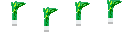

# 03_PIXEL_FORGE

> **Дата:** 22.09.2026  
> **Студент:** борзенков кирилл игоревич кирюхин кирилл виталийвич 

## ОПИСАНИЕ
Напишите описание вашей работы 

## СОЗДАННЫЕ АССЕТЫ

### 1. Персонаж и Враг
* **Игрок**: [мику]
* **Враг**: [лук мику]
* **Анимация**: Состоит из [непомню] кадров.

### 2. Окружение
* Создан тайл пола и стены.
* Создан предмет для сбора: [монгал и ключ].

## ПРЕВЬЮ ГРАФИКИ

